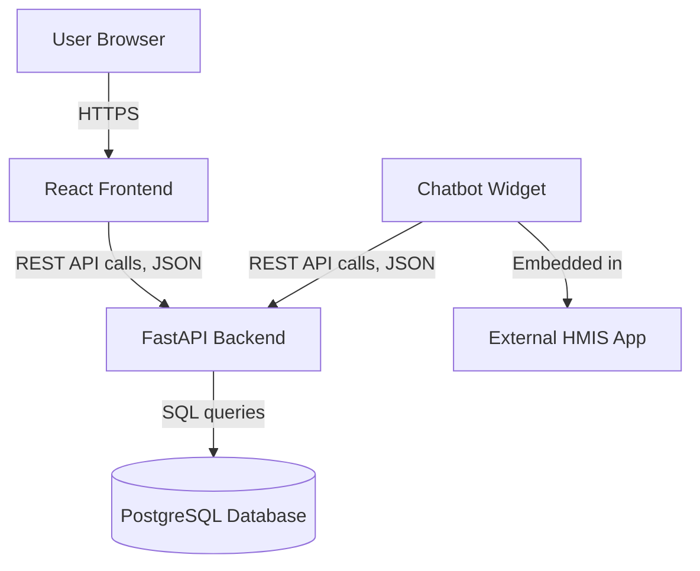

# PulseDesk-KB — System Architecture

```mermaid
graph TD
    A[User Browser] -->|HTTPS| B[React Frontend]
    B -->|REST API calls, JSON| C[FastAPI Backend]
    C -->|SQL queries| D[(PostgreSQL Database)]
    E[Chatbot Widget] -->|Embedded in| F[External HMIS App]
    E -->|REST API calls, JSON| C
```