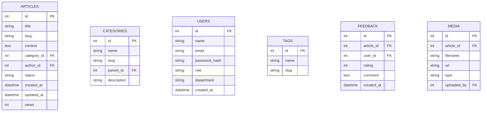

# PulseDesk-KB — Database Schema (ERD)

```mermaid
erDiagram
    ARTICLES {
        int id PK
        string title
        string slug
        text content
        int category_id FK
        int author_id FK
        string status
        datetime created_at
        datetime updated_at
        int views
    }
    CATEGORIES {
        int id PK
        string name
        string slug
        int parent_id FK
        string description
    }
    USERS {
        int id PK
        string name
        string email
        string password_hash
        string role
        string department
        datetime created_at
    }
    TAGS {
        int id PK
        string name
        string slug
    }
    FEEDBACK {
        int id PK
        int article_id FK
        int user_id FK
        int rating
        text comment
        datetime created_at
    }
    MEDIA {
        int id PK
        int article_id FK
        string filename
        string url
        string type
        int uploaded_by FK
    }
```